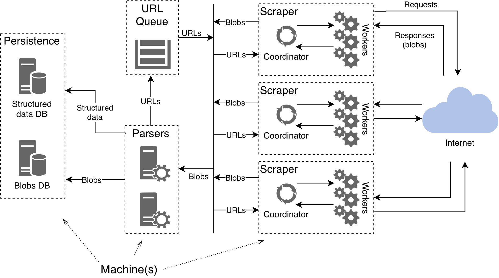
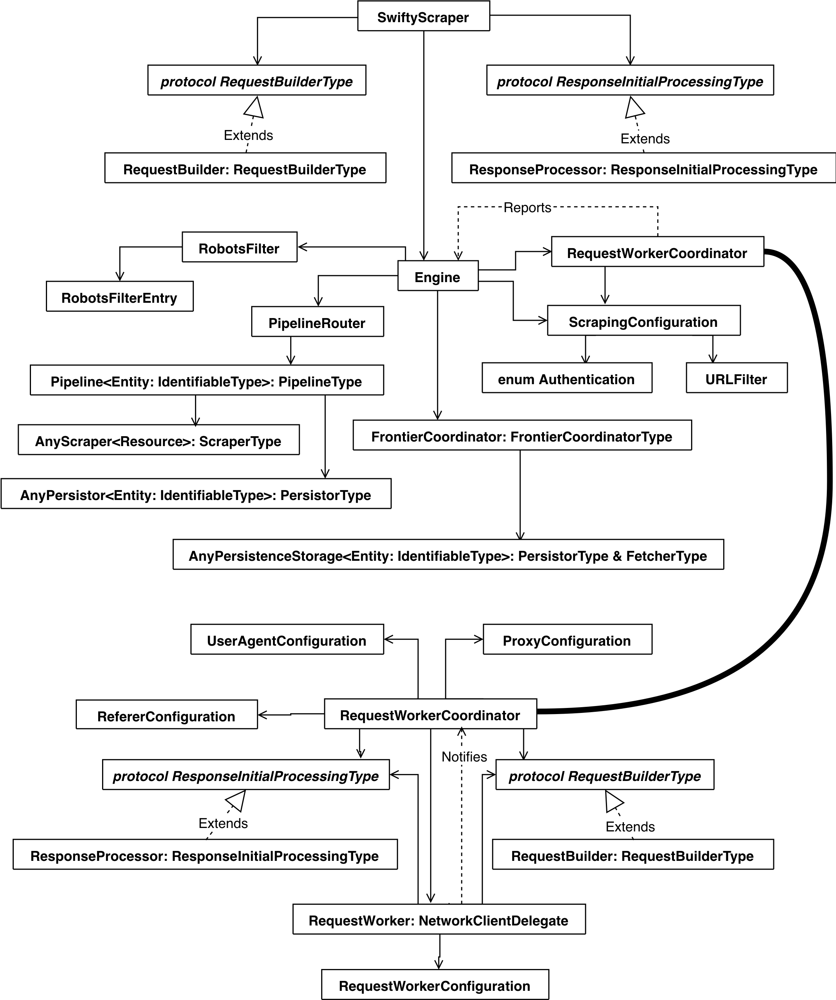

# SwiftyScraper
A lightweight, fully modular and customizable library for creating web crawlers and web scrapers. Using this library it's super easy to create sophisticated crawlers or scrapers. All the heavy lifting has been implemented for your. Thanks to its modular and protocol oriented design almost all functionality can be tailored to specific needs for every website.  

This library was created as part of a masters thesis and is under MIT license (except for some of its dependencies).  
Dependencies:
- [SwiftSoup](https://github.com/scinfu/SwiftSoup)
- [Kitura-Redis](https://github.com/IBM-Swift/Kitura-redis)
- [BlueSocket](https://github.com/IBM-Swift/BlueSocket)

## Main features: 
- Open-source								
- Developed in Swift
- Deals with broken HTML (SwiftSoup)  
- Redis support (Kitura-Redis)
- Ability to set one or more starting URLs			
- Rotating proxies						
- Rotating User-Agents					
- Rotating Referers						
- Specifying Cookies to use				
- Duplicate URLs filtering				
- Handles HTTP response codes appropriately
- Automatically retries failed URLs							
- Automatic (random) throttling of requests
- Random request delay					
- Uses a session (for keep-alive)		
- Support for reading sitemaps			
- Support for robots.txt								
- Which links to follow or not (template)			
- Configurable list of User-Agents to rotate			
- Configurable list of Proxies to rotate				
- Configurable list of Referers to rotate                         
- Modular (DB adapters, parsers, etc.)
- Crawl (URL) depth limit						
- Total URLs crawled count limit			
- Total scraping workers limit			
- Max URLs per worker						
- Request timeout							
- Request retry limit						
- Basic authentication credentials	

Most of these features is configurable via `Resources/configuration.json`, `Resources/user_agents.json`, `Resources/proxies.json` and `Resources/referers.json`.

## Overview
Language: Swift  
Supported platforms: macOS (Linux after Foundation has been fully ported -- mainly networking).
When build with `DEBUG` configuration, there'll be a `log` directory created with all debug output.

## Architecture

With decentralization in mind it is possible to built distributed crawlers and scrapers like this:  



The basic overview of the architecture is something like this:



The main idea is that a link scraper extracts all relevant links from an HTML, filtering is applied, URL entries are added to a URL frontier and responses with raw data are passed to the pipeline router. The router then passes this data to relevant pipelines (defined with `contentType` and `urlTemplate` vars).

A pipeline consists of `AnyScraper` that is a type erased `ScraperType` object for scraping relevant data and an optional `AnyPersistor`, type erased `PersistorType`, for feeding extracted data to a remote database, etc.


## Simplest usage
With the base implementations of all protocols it is possible to create a simple link crawler right away.
```swift
// Create a URL fontier in-memory storage
let urlStore: AnyPersistenceStorage = AnyPersistenceStorage(MemoryPersistenceStorage<URLEntry>())
let historyURLStore: AnyPersistenceStorage = AnyPersistenceStorage(MemoryPersistenceStorage<URLHistoryEntry>())
// or Redis backed storage
let urlStore: AnyPersistenceStorage = AnyPersistenceStorage(URLEntryRedisStore())
let historyURLStore: AnyPersistenceStorage = AnyPersistenceStorage(URLHistoryEntryRedisStore())
// Frontier
let frontier = FrontierCoordinator(entryStorage: urlStore,
                                   historyEntryStorage: historyURLStore)

// Configuration
let configuration = FileProvier.readConfiguration()

// Pipeline router
let pipelineRouter = PipelineRouter.shared

// Register pipelines
pipelineRouter.register(pipeline: Pipeline(scraper: AnyScraper(LinkScraper()), persistor: nil))

// Main scraper
let scraper = SwiftyScraper(startURLs: ["urlIWantToScrape"], 
                            configuration: configuration, 
                            urlFrontier: frontier, 
                            pipelineRouter: pipelineRouter)
// Start the scraping process
scraper.start()
```

## Example
Explore the `WeatherFetcher` example project to see how to implement the `ScraperType` protocol.

## Instalation
Clone the repo and copy `SwiftyScraper` into your project.

## Future improvements  
- Implement an interactive scraper for JavaScript interpretation, injection and interactive HTML manipulation (backed by a Selenium process and a driver)

## Versions
**1.0.0** - Current version

# License
MIT (except some dependencies)
